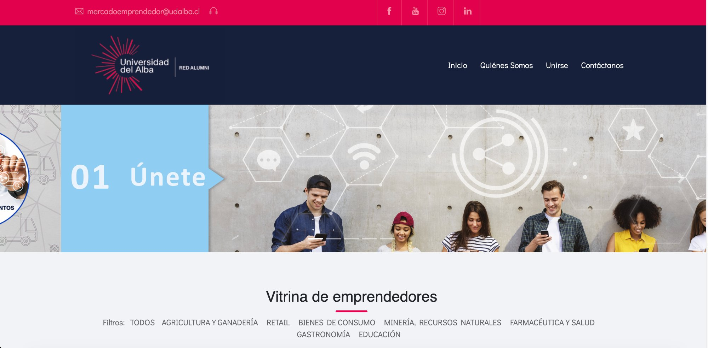
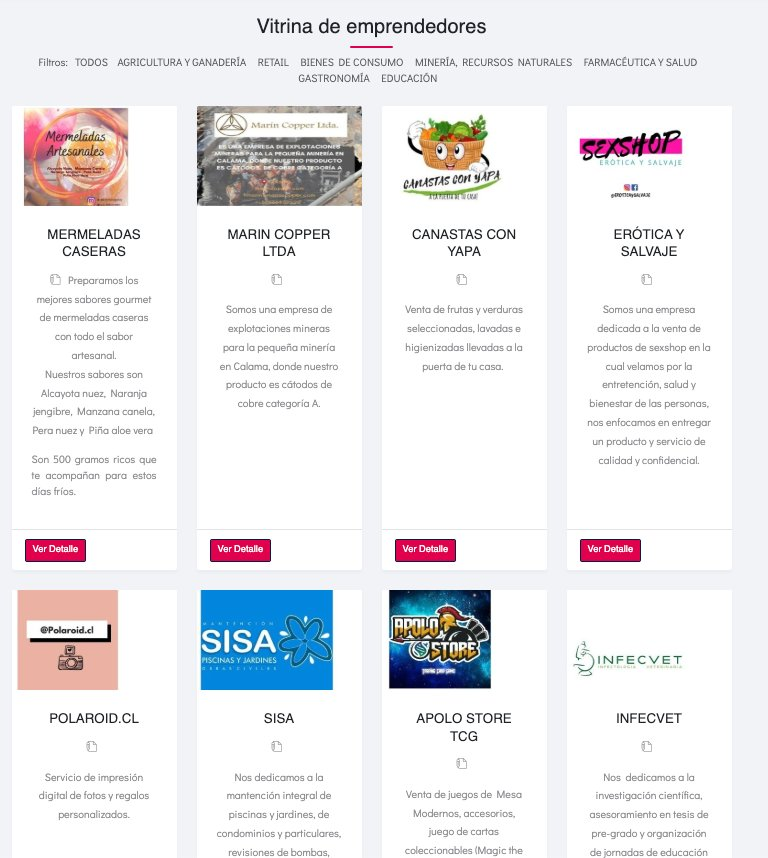

# Mercado Emprendedor

Entrepreneur marketplace showcasing businesses from the Universidad del Alba alumni and community network.

🔗 **Live:** [mercadoemprendedor.udalba.cl](https://mercadoemprendedor.udalba.cl/)

## Overview

A digital showcase platform connecting university entrepreneurs with potential customers. Part of the Red Alumni initiative, the platform promotes small businesses created by students, alumni, and staff across multiple industries.

## Screenshots

### Homepage

*Landing page with hero banner and category filters*

### Entrepreneur Directory

*Grid view of registered businesses with category filtering*

## Features

- **Entrepreneur Profiles** — Each business has a dedicated page with description, images, and contact info
- **Category Filtering** — Filter by industry (Agriculture, Retail, Gastronomy, Health, Education, Mining, etc.)
- **Registration System** — Entrepreneurs can apply to join the platform
- **Responsive Design** — Works on desktop and mobile devices
- **Contact Integration** — Direct links to entrepreneur contact information

## Categories

- 🌾 Agricultura y Ganadería (Agriculture)
- 🛒 Retail
- 🛍️ Bienes de Consumo (Consumer Goods)
- ⛏️ Minería, Recursos Naturales (Mining)
- 💊 Farmacéutica y Salud (Pharma & Health)
- 🍽️ Gastronomía (Food & Beverage)
- 📚 Educación (Education)

## Featured Entrepreneurs

The platform showcases diverse businesses including:
- Artisanal food products (jams, honey, pastries)
- Mining services
- Health & wellness centers
- Photo printing services
- Pool & garden maintenance
- Trading card games stores
- Veterinary research
- Fashion boutiques
- And many more...

## Tech Stack

- **Backend:** Laravel 5, PHP
- **Frontend:** Blade, Bootstrap 4, HTML5
- **Database:** MySQL
- **Features:** Image carousel, category filters, contact forms

## Client

**Universidad del Alba**  
Red Alumni Network  
Santiago, Chile

## Contact

**Marcelo Toro**  
Full Stack Developer

- 📧 mtoro6@gmail.com
- 💼 [LinkedIn](https://linkedin.com/in/marcelo-toro-toro)
- 🌐 [Portfolio](https://marcelo-toro-portfolio.netlify.app/)
